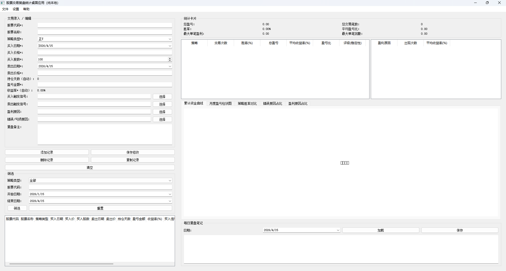
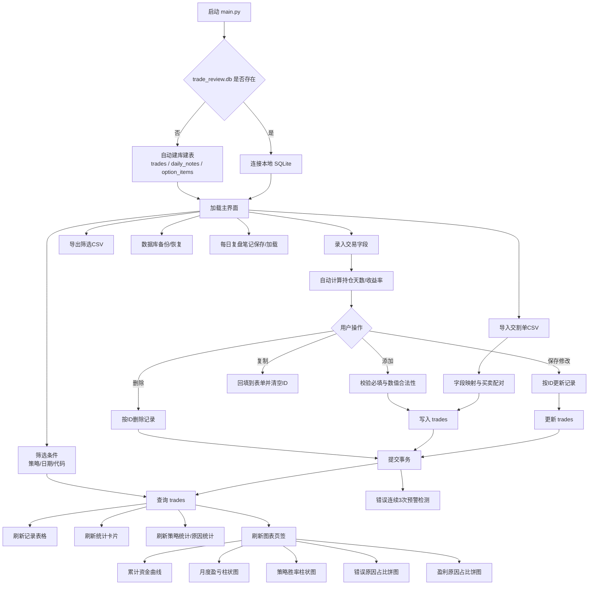

# 股票交易复盘统计桌面应用（纯本地）

## 📈 股票交易复盘系统 · 把亏损变成经验

一个**纯本地、无广告、开箱即用**的股票交易统计与复盘桌面软件。  
不再依赖 Excel 手工记账，不再凭感觉评估策略好坏——用数据看清你的每一笔交易。

### 🔥 为什么你需要它？

- 😫 **手工记账太麻烦**：同花顺导出的交割单格式混乱，Excel 公式一多就崩。
- 😵 **策略太多难管理**：隔夜超短、做 T、波段、打板……到底哪个策略在帮你赚钱？
- 🤔 **亏得不明不白**：是追高？没止损？还是信号误判？没有归因分析，错误就会一直重复。

### ✅ 它能做什么？

- **一键导入交割单**：支持同花顺/通达信导出的 CSV，自动解析，告别手工录入。
- **全策略统一管理**：隔夜超短、正 T / 反 T、波段持有、趋势跟踪、打板……一个软件全部记录。
- **双维度归因分析**：
  - 盈利原因统计：顺势持有？信号精准？帮你总结**成功模式**。
  - 亏损原因统计：追高？没止损？大盘拖累？帮你定位**错误根源**。
- **可视化统计看板**：
  - 累计资金曲线、月度盈亏柱状图。
  - 各策略胜率对比、盈亏比排序。
  - 错误原因饼图——一眼看出哪个坏习惯亏钱最多。
- **纯本地运行，数据安全**：所有数据存在你自己的电脑里，无需联网，永不收费。

### 📸 界面预览



### 🚀 快速开始

1. 下载右侧 [Releases](链接) 中的 `.exe` 文件。
2. 双击运行（无需安装 Python 环境）。
3. 导入交割单或手动添加第一笔交易，开始你的复盘之旅。

### 🛠 技术栈

- Python 3.10 + PyQt5
- SQLite3 + pandas
- matplotlib（数据可视化）
- PyInstaller（打包为单文件 exe）

### 📋 待办清单 / 未来计划

- [ ] 支持更多券商交割单格式（华泰、中信等）
- [ ] 增加持仓截图 OCR 识别自动录入
- [ ] 策略回测模拟功能

### 🤝 贡献与反馈

欢迎提 Issue 或 PR。如果你觉得有用，请给个 ⭐ Star 支持一下！

---

## 📈 Stock Trading Journal & Analytics Desktop App

A **local-first, no-BS** desktop application for tracking and analyzing your stock trades.  
Stop guessing which strategy works - let data tell the truth.

### ✨ Features

- **Multi-Strategy Support**: Day trade, swing trade, T+0 scalping, trend following... all in one place.
- **One-Click Import**: Parse your brokerage CSV export (TongHuaShun/TDX supported).
- **Win/Loss Attribution**: Tag each trade with reasons (e.g., "signal accuracy", "chasing highs", "no stop loss"). Visualize what makes you money and what kills your account.
- **Interactive Dashboard**: Equity curve, monthly PnL bars, strategy win rate comparison, error pie chart.
- **100% Local & Private**: Your data never leaves your computer.

### 📦 Download

Get the latest `.exe` from [Releases](link). No installation required.

### ⭐ Support

If this tool helps you become a better trader, give it a star!

---

基于 `PyQt5 + SQLite + pandas + matplotlib` 的股票交易复盘工具。  
应用离线运行，数据全部保存在本地数据库，适合个人长期复盘与策略优化。

---

## 项目优势

- **纯本地离线**：不依赖网络、后端服务或第三方 API。
- **数据安全可控**：交易与复盘数据保存在本地 `SQLite` 文件。
- **全流程覆盖**：录入、筛选、统计、图表、导入导出、备份恢复一体化。
- **可视化复盘**：多图表页签快速定位策略优劣与错误模式。
- **高度可配置**：策略类型、信号、盈利原因、错误原因支持软件内自定义。
- **可打包交付**：支持 `PyInstaller` 打包单文件 `exe`，双击即可运行。

---

## 功能清单

### 1. 交易记录管理（CRUD）

- 手动录入字段：
  - 股票代码（必填）、股票名称
  - 策略类型（下拉可编辑）
  - 买入日期/价格/股数（必填）
  - 卖出日期/价格（必填）
  - 持仓天数（自动计算）
  - 盈亏金额（自动计算，可手动修正）
  - 收益率（自动计算）
  - 买入触发信号（多选 + 文本）
  - 卖出触发信号（多选 + 文本）
  - 盈利原因（多选 + 文本）
  - 错误/亏损原因（多选 + 文本）
  - 复盘备注
- 支持操作：新增、编辑、删除、复制、清空。
- 表格展示全部记录，支持筛选：
  - 按策略类型
  - 按日期范围
  - 按股票代码模糊匹配
- 支持导入同花顺/通达信交割单 CSV（自动解析并买卖配对）。

### 2. 统计分析看板

- 顶部卡片：
  - 总盈亏
  - 总交易笔数
  - 胜率
  - 平均盈亏比
  - 最大单笔盈利
  - 最大单笔回撤
- 策略分组统计表：
  - 交易次数、胜率、总盈亏、平均收益率、盈亏比、稳定性评分
  - 点击策略可查看该策略交易明细
- 盈利原因统计表：
  - 出现次数、平均收益率

### 3. 图表区域（嵌入界面，Tab 切换）

- 累计资金曲线（按日期排序累计盈亏）
- 月度盈亏柱状图
- 策略胜率对比柱状图
- 错误原因占比饼图（含百分比）
- 盈利原因占比饼图（含百分比）

### 4. 复盘辅助

- 每日复盘笔记：按日期保存/加载。
- 错误预警：同一错误原因连续出现 3 次以上弹窗提醒。
- 策略评级：提供基于收益波动的稳定性评分（近似夏普思想）。

### 5. 数据管理

- 导出当前筛选结果为 CSV。
- 全量数据库备份与恢复。
- 下拉选项可在软件内增删改（策略类型、买卖信号、盈亏原因、错误原因）。

---

## 界面布局

- 主窗口：`1600 x 900`
- 左栏（约 35%）：
  - 交易录入表单
  - 操作按钮
  - 筛选区
  - 记录表格
- 右栏（约 65%）：
  - 上方统计卡片
  - 中部统计表
  - 下方图表页签区
  - 底部每日复盘笔记
- 菜单栏：
  - 文件（导入/导出/备份/恢复）
  - 设置（自定义下拉选项）
  - 帮助（关于）

---

## 技术栈

- Python 3.10+
- PyQt5
- sqlite3
- pandas
- matplotlib
- PyInstaller

---

## 项目结构

```text
.
├─ main.py               # 主程序
├─ requirements.txt      # 依赖
├─ README.md             # 项目说明
└─ trade_review.db       # 运行后自动生成
```

---

## 快速开始

### 1) 安装依赖

```bash
pip install -r requirements.txt
```

### 2) 启动程序

```bash
python main.py
```

首次启动会自动创建 `trade_review.db` 并初始化所需数据表。

### English Quick Start

1. Install dependencies:

```bash
pip install -r requirements.txt
```

2. Run the app:

```bash
python main.py
```

On first launch, the app auto-creates `trade_review.db` locally.

---

## PyInstaller 打包（单 exe / 无黑框）

### 基础命令

```bash
python -m PyInstaller --noconfirm --clean --onefile --windowed --name "TradeReviewApp" main.py
```

### 使用图标（如果存在 `复盘.ico`）

```bash
python -m PyInstaller --noconfirm --clean --onefile --windowed --icon "复盘.ico" --name "TradeReviewApp" main.py
```

### 若环境中有多个 Qt 绑定（如 PySide6），建议排除

```bash
python -m PyInstaller --noconfirm --clean --onefile --windowed --exclude-module PySide6 --name "TradeReviewApp" main.py
```

打包输出：

```text
dist/TradeReviewApp.exe
```

### English Build (Single EXE / No Console)

```bash
python -m PyInstaller --noconfirm --clean --onefile --windowed --name "TradeReviewApp" main.py
```

---

## 数据库说明

### 表一：`trades`（交易记录）

核心字段：

- `stock_code`、`stock_name`
- `strategy_type`
- `buy_date`、`buy_price`、`buy_shares`
- `sell_date`、`sell_price`
- `hold_days`
- `pnl_amount`、`pnl_ratio`
- `buy_signals`、`sell_signals`
- `profit_reasons`、`error_reasons`
- `review_note`
- `created_at`、`updated_at`

### 表二：`daily_notes`（每日复盘笔记）

- `note_date`（唯一）
- `content`
- `updated_at`

### 表三：`option_items`（自定义选项）

- `category`（分类）
- `value`（选项值）

---

## 完整流程图



---

## 常见问题（FAQ）

### 1) `dist` 目录没有 exe

- 先确认 `python -m PyInstaller --version` 可正常输出版本。
- 查看打包日志末尾是否有 `Build complete!`。
- 建议优先使用模块方式打包：`python -m PyInstaller ...`。

### 2) 报错：multiple Qt bindings packages

环境中可能同时存在 `PyQt5` 和 `PySide6`，打包时加：

```bash
--exclude-module PySide6
```

### 3) 导入 CSV 失败

- 检查是否包含常见字段：代码/名称/日期/买卖/价格/数量。
- 编码建议优先 `utf-8-sig`，不行可尝试 `gbk`。

---

## 免责声明

本工具仅用于交易复盘与统计分析，不构成任何投资建议。  
请根据自身风险承受能力独立判断与决策。

